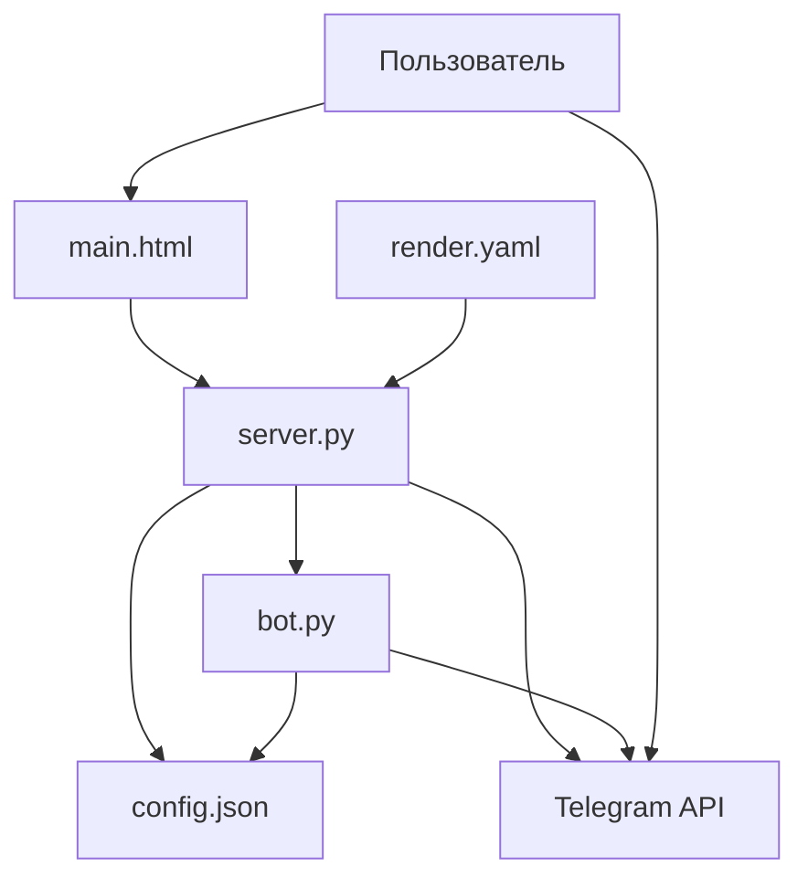
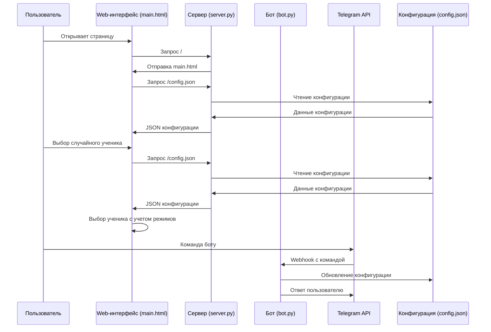
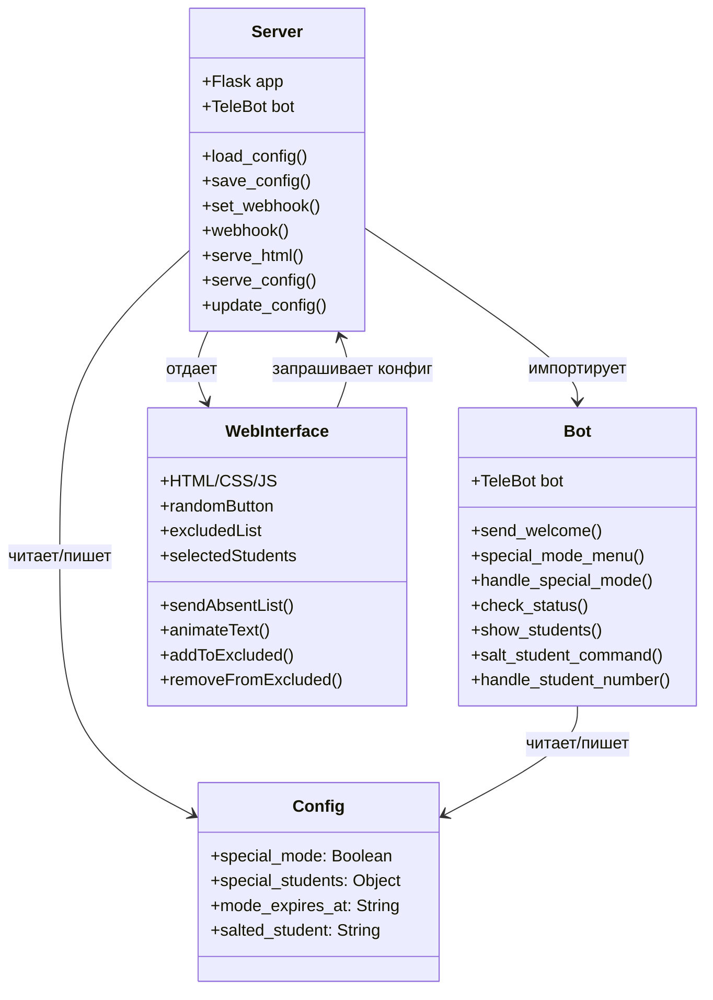

# Документация проекта "Шайтан-машина"

## 1. Структура проекта

```
shaytan-machine/
  ├── bot.py           # Логика Telegram-бота
  ├── config.json      # Файл конфигурации
  ├── main.html        # Веб-интерфейс
  ├── render.yaml      # Конфигурация для деплоя на Render
  ├── requirements.txt # Зависимости проекта
  └── server.py        # Серверная часть (Flask)
```

## 2. Описание файлов

### bot.py
**Назначение**: Реализация логики Telegram-бота для управления шайтан-машиной.

**Ключевые функции/классы**:
- `send_welcome()` - Обработчик команды /start
- `special_mode_menu()` - Меню для включения режима "свои"
- `handle_special_mode()` - Обработка выбора времени для режима "свои"
- `check_status()` - Проверка статуса режима "свои"
- `show_students()` - Отображение списка учеников
- `salt_student_command()` - Команда для "насаливания" ученика
- `handle_student_number()` - Обработка выбора номера ученика для "насаливания"
- `BotStates` - Класс для хранения состояний бота

**Связи с другими файлами**:
- Импортирует объект `bot` из `server.py`
- Читает и записывает данные в `config.json`

**Краткое объяснение логики**:
Бот обрабатывает команды пользователя, позволяя управлять режимами работы шайтан-машины. Основные режимы: обычный, "свои" (исключение определенных учеников из выбора) и "насолить" (гарантированный выбор конкретного ученика). Бот сохраняет настройки в конфигурационный файл, который затем используется веб-интерфейсом.

### server.py
**Назначение**: Серверная часть приложения, обеспечивающая работу веб-интерфейса и связь с Telegram-ботом.

**Ключевые функции/классы**:
- `set_webhook()` - Настройка вебхука для Telegram
- `webhook()` - Обработчик вебхуков от Telegram
- `serve_html()` - Отдача веб-интерфейса
- `serve_config()` - Отдача текущей конфигурации
- `update_config()` - Обновление конфигурации
- `load_config()` и `save_config()` - Работа с конфигурацией в памяти
- `keepalive()` - Функция для поддержания работы сервера

**Связи с другими файлами**:
- Импортирует обработчики из `bot.py`
- Отдает `main.html` клиенту
- Работает с данными из `config.json`

**Краткое объяснение логики**:
Сервер на Flask обеспечивает работу веб-интерфейса и взаимодействие с Telegram API через вебхуки. Он хранит конфигурацию в памяти и синхронизирует ее между ботом и веб-интерфейсом. Также реализована функция поддержания работы сервера через периодические запросы к самому себе.

### main.html
**Назначение**: Веб-интерфейс шайтан-машины для выбора случайного ученика.

**Ключевые функции/классы**:
- Интерфейс со списком учеников
- Кнопка случайного выбора ученика
- Функционал отметки отсутствующих учеников
- Анимации для отображения выбранного ученика
- Функции для работы с конфигурацией (`sendAbsentList`, `animateText`, `addToExcluded`, `removeFromExcluded`)

**Связи с другими файлами**:
- Запрашивает конфигурацию с сервера (`/config.json`)
- Отправляет данные на сервер

**Краткое объяснение логики**:
Веб-интерфейс позволяет выбирать случайного ученика из списка, учитывая настройки режимов "свои" и "насолить". Также можно отмечать отсутствующих учеников, которые исключаются из выбора. Интерфейс периодически запрашивает конфигурацию с сервера для учета изменений, внесенных через Telegram-бота.

### config.json
**Назначение**: Хранение настроек и состояния шайтан-машины.

**Ключевые поля**:
- `special_mode` - Флаг включения режима "свои"
- `special_students` - Объект с информацией о "своих" учениках
- `mode_expires_at` - Время истечения режима "свои"
- `salted_student` - Номер "насоленного" ученика

**Связи с другими файлами**:
- Читается и обновляется из `bot.py` и `server.py`
- Запрашивается веб-интерфейсом через API

**Краткое объяснение логики**:
Конфигурационный файл хранит текущее состояние шайтан-машины, включая активные режимы и их параметры. Он служит точкой синхронизации между ботом и веб-интерфейсом.

### requirements.txt
**Назначение**: Список зависимостей проекта для установки через pip.

**Ключевые компоненты**:
- Flask - Веб-фреймворк
- Flask-CORS - Поддержка CORS для API
- pyTelegramBotAPI - Библиотека для работы с Telegram Bot API
- gunicorn - WSGI-сервер для продакшена
- Werkzeug - Утилиты для WSGI
- requests - HTTP-клиент

**Связи с другими файлами**:
- Используется в `render.yaml` для установки зависимостей

**Краткое объяснение логики**:
Файл определяет необходимые библиотеки и их версии для корректной работы приложения.

### render.yaml
**Назначение**: Конфигурация для деплоя на платформе Render.

**Ключевые компоненты**:
- Тип сервиса: web
- Имя: shaytan-web
- Команда сборки: `pip install -r requirements.txt`
- Команда запуска: `gunicorn server:app`
- Версия Python: 3.9.0

**Связи с другими файлами**:
- Использует `requirements.txt` для установки зависимостей
- Запускает `server.py` через gunicorn

**Краткое объяснение логики**:
Файл содержит инструкции для платформы Render о том, как собрать и запустить приложение в облаке.

## 3. Архитектура проекта

### Общая структура

Проект построен на основе клиент-серверной архитектуры с дополнительным компонентом в виде Telegram-бота. Серверная часть реализована на Flask, клиентская - на HTML/CSS/JavaScript. Telegram-бот интегрирован в серверную часть и использует общую конфигурацию с веб-интерфейсом.

### Потоки данных



### Диаграмма последовательности



### Диаграмма классов



## 4. Библиотеки/фреймворки

### Flask (2.0.1)
**Назначение**: Веб-фреймворк для Python.
**Где используется**: В `server.py` для создания веб-сервера и API.

### Flask-CORS (3.0.10)
**Назначение**: Расширение для Flask, обеспечивающее поддержку CORS.
**Где используется**: В `server.py` для обеспечения доступа к API из веб-интерфейса.

### pyTelegramBotAPI (4.14.0)
**Назначение**: Библиотека для работы с Telegram Bot API.
**Где используется**: В `bot.py` и `server.py` для создания и управления Telegram-ботом.

### gunicorn (20.1.0)
**Назначение**: WSGI HTTP-сервер для Python.
**Где используется**: В `render.yaml` как сервер для запуска приложения в продакшене.

### Werkzeug (2.0.1)
**Назначение**: Набор утилит WSGI для Python.
**Где используется**: Используется Flask'ом внутренне.

### requests (2.31.0)
**Назначение**: HTTP-клиент для Python.
**Где используется**: В `server.py` для функции keepalive.

## 5. Точка входа и запуск

### Как запускается проект
Проект может быть запущен локально с помощью команды:
```bash
python server.py
```

Для продакшен-запуска используется gunicorn:
```bash
gunicorn server:app
```

На платформе Render проект запускается автоматически согласно конфигурации в `render.yaml`.

### Что выполняется первым
1. Создается экземпляр Flask-приложения в `server.py`
2. Создается экземпляр Telegram-бота
3. Импортируются обработчики из `bot.py`
4. При первом запросе устанавливается вебхук для Telegram
5. Запускается поток keepalive для поддержания работы сервера
6. Сервер начинает обрабатывать запросы

## 6. Архитектурные особенности

### Нестандартные решения
1. **Гибридная архитектура**: Объединение веб-интерфейса и Telegram-бота в одном приложении с общей конфигурацией.
2. **In-memory конфигурация**: Хранение конфигурации в памяти сервера с периодической синхронизацией с файлом.
3. **Keepalive механизм**: Отдельный поток, который периодически отправляет запросы к серверу для предотвращения его остановки на бесплатных хостингах.
4. **Режимы работы**: Реализация специальных режимов "свои" и "насолить", влияющих на алгоритм выбора ученика.

### Причины выбора архитектуры
1. **Интеграция веб-интерфейса и бота**: Позволяет управлять системой как через веб, так и через Telegram, что удобно для преподавателя.
2. **Использование Flask**: Легковесный фреймворк, подходящий для простого веб-приложения с API.
3. **Хранение конфигурации в памяти**: Обеспечивает быстрый доступ и снижает нагрузку на файловую систему.
4. **Деплой на Render**: Бесплатный хостинг с поддержкой Python и возможностью настройки через YAML-файл.

Архитектура проекта оптимизирована для конкретной задачи - создания системы случайного выбора ученика с возможностью управления через веб-интерфейс и Telegram-бота. Она обеспечивает достаточную гибкость и простоту использования при минимальных требованиях к инфраструктуре.
